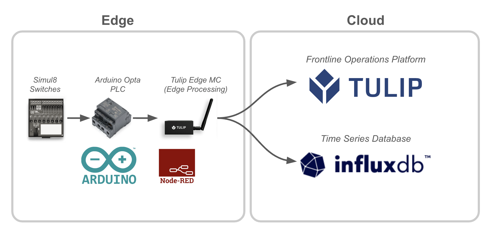
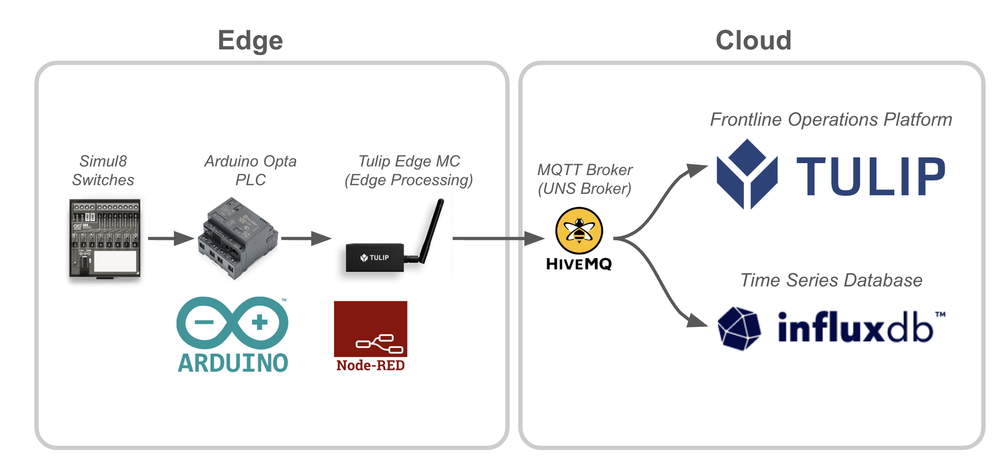

# Arduino-Opta---Habit-Tracker
Habit Tracker using Arduino Opta, Simul8, and Tulip

# Purpose
The goal of this Proof of Concept Project was to learn more about PLC programming with Arduino Opta and integrate with MQTT on a local edge network as well as a public internet network.

## Example Usage
You can trigger one of 8 switches which correspond to an activity, this is sent to the edge device (Tulip Edge MC), the Edge MC then writes it to Tulip as well as an InfluxDB database. This data can then be aggregated and analyzed to understand what activities you're doing throughout the day.

## Architecture
There are two potential architectures:
1. Integrate directly with cloud systems on the edge device (e.g., use an influxDB node and a tulip tags node)

2. Integrate via a common cloud MQTT Broker -- Send the data to an MQTT Broker (e.g., HiveMQ); then, specific systems can subscribe to it. NOTE: this requires the use of a telegraf client for InfluxDB

## Notes
I had some constraints using the PLC IDE on MacOS, so the majority of the Arduino Opta is programmed on Arduino (C++) instead.